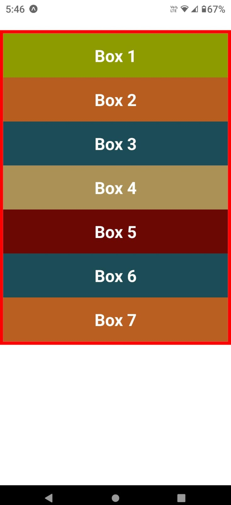

# Notes for lessons 25-38

# Contents - FlexBox layout in React Native

### 25. Layout with FlexBox

// At the core of layout design in RN => FlexBox

//2 main entities:

1. flex container (parent)
2. flex items (children)

//2 axes:

1. main axis - top to bottom
2. cross axis - left to right

### 26. Code SetUp

```js
//Box.jsx
import { View, Text, StyleSheet } from 'react-native';

export default function Box({ children, style }) {
	return (
		<View style={[styles.box, style]}>
			<Text style={styles.text}>{children}</Text>
		</View>
	);
}

const styles = StyleSheet.create({
	box: { backgroundColor: '#fff', padding: 20 },
	text: {
		fontSize: 24,
		fontWeight: 'bold',
		textAlign: 'center',
		color: 'white',
	},
});

//App.jsx
import { View, StyleSheet } from 'react-native';
import Box from './components/Box';

export default function App() {
	return (
		<View style={styles.container}>
			<Box style={{ backgroundColor: '#8e9b00' }}>Box 1</Box>
			<Box style={{ backgroundColor: '#b65d1f' }}>Box 2</Box>
			<Box style={{ backgroundColor: '#1c4c56' }}>Box 3</Box>
			<Box style={{ backgroundColor: '#ab9156' }}>Box 4</Box>
			<Box style={{ backgroundColor: '#6b0803' }}>Box 5</Box>
			<Box style={{ backgroundColor: '#1c4c56' }}>Box 6</Box>
			<Box style={{ backgroundColor: '#b95f21' }}>Box 7</Box>
		</View>
	);
}

const styles = StyleSheet.create({
	container: { marginTop: 64, borderWidth: 6, borderColor: 'red' },
});


```

### 27. Flex

//The 'flex' property plays a cruicial role in defining how much of a view will fill the screen along the ain axis.

//It accepts an integer value greater than or equal to 0, indicating the fraction of the available space the component should occupy.

//By default, display of the <View> is set to flex in RN.

//Flex Containers only takes up space required by it's children (if it has any)
Ex:

```js
<View style={{ backgroundColor: 'green', flex: 1 }}></View>
```

//flex: 1, taking up the full space.
//Uneven distribution:

```js
export default function App() {
	return (
		// <View style={{backgroundColor: "green", flex:1}}></View>
		<View style={styles.container}>
			<Box style={{ backgroundColor: '#8e9b00', flex: 1 }}>Box 1</Box>
			<Box style={{ backgroundColor: '#b65d1f', flex: 3 }}>Box 2</Box>
			<Box style={{ backgroundColor: '#1c4c56' }}>Box 3</Box>
			<Box style={{ backgroundColor: '#ab9156' }}>Box 4</Box>
			<Box style={{ backgroundColor: '#6b0803' }}>Box 5</Box>
			<Box style={{ backgroundColor: '#1c4c56' }}>Box 6</Box>
			<Box style={{ backgroundColor: '#b95f21' }}>Box 7</Box>
		</View>
	);
}

const styles = StyleSheet.create({
	container: { marginTop: 64, borderWidth: 6, borderColor: 'red', flex: 1 },
});
```

### 28. Flex-Direction

//The 'flexDirection' property establishes the ain axis, which in turn determines the how the flex items are placed within the container.

//By default, the main axis flows from top to bottom, causing the items to be displayed fro top to bottom in the UI.

//By changing the value of the flexDirection property, can alter how the ites are positioned.

//Ex- flexDirection: "row-reverse"

### 29. Justify-Content

//justifyContent defines the alignent along the "MAIN-AXIS", we mainly set it on the containers.

### 30. Align-Items

//alignItems defines the default behaviour for laying out flex items along the container's "CROSS-AXIS".

//Works similarly to justifyContent, but, in the perpendicular direction.

### 31. Align-Self

//alignItems is applied to the container and controls the alignment of all items within it.

//alignSelf is applied to individual ites, allowing us to control the alignment of each of them individually.

//The values available for alignSelf are similar to those used in alignItems.

//By default, "auto", otherwise inheriting the parent container's alignItems property.

```js
import { View, StyleSheet } from 'react-native';
import Box from './components/Box';

export default function App() {
	return (
		// <View style={{backgroundColor: "green", flex:1}}></View>
		<View style={styles.container}>
			<Box style={{ backgroundColor: '#8e9b00', alignSelf: 'flex-start' }}>
				Box 1
			</Box>
			<Box style={{ backgroundColor: '#b65d1f', alignSelf: 'flex-end' }}>
				Box 2
			</Box>
			<Box style={{ backgroundColor: '#1c4c56', alignSelf: 'center' }}>
				Box 3
			</Box>
			<Box style={{ backgroundColor: '#ab9156', alignSelf: 'stretch' }}>
				Box 4
			</Box>
			<Box style={{ backgroundColor: '#6b0803', alignSelf: 'auto' }}>Box 5</Box>
			<Box style={{ backgroundColor: '#1c4c56' }}>Box 6</Box>
			<Box style={{ backgroundColor: '#b95f21' }}>Box 7</Box>
		</View>
	);
}

const styles = StyleSheet.create({
	container: {
		flex: 1,
		alignItems: 'stretch',
		marginTop: 64,
		borderWidth: 6,
		borderColor: 'red',
	},
});
```

### 32. Flex-Wrap

//flexWrap allows us to control how flex items behave when there's limited space within the container.

//3 possible values:

1. "nowrap" //default
2. "wrap"
3. "wrap-reverse"

```js
const styles = StyleSheet.create({
	container: {
		//flex: 1,
		flexWrap: 'wrap-reverse',
		height: 300,
		marginTop: 64,
		borderWidth: 6,
		borderColor: 'red',
	},
});
```

### 33. Align-Content

//The alignContent property aligns the lines of content across the "CROSS-AXIS".
//Similar o how the alignItems property aligns individual items along the "CROSS-AXIS".
//A very important condition is that multiple columns or rows must exist within the container.

//default: flex-start

### 34. Gap

//Gap related properties allow us to manage spacing between rows and columns.

1. rowGap
2. columnGap
3. gap

```js
const styles = StyleSheet.create({
	container: {
		//flex: 1,
		flexWrap: 'wrap', //Wrapping is essential for alignContent
		// alignContent: 'flex-end',
		rowGap: 20,
		columnGap: 30,
		gap: 10, //shorthand, for both rowGap and columnGap
		height: 300,
		marginTop: 64,
		borderWidth: 6,
		borderColor: 'red',
	},
});
```

### 35. Flex-Basis

//The flexBasis property determines the initial size of a flex item before any extra space in the container is distributed.

//Alternative to using the height and width properties in flex layouts.
//Sets initial height.

```js
export default function App() {
	return (
		//<View style={{backgroundColor: "green", flex:1}}></View>
		<View style={styles.container}>
			<Box style={{ backgroundColor: '#8e9b00' }}>Box 1</Box>
			<Box style={{ backgroundColor: '#b65d1f' }}>Box 2</Box>
			<Box style={{ backgroundColor: '#1c4c56', flexBasis: 140, flex: 1 }}>
				Box 3
			</Box>
			<Box style={{ backgroundColor: '#ab9156', height: 140 }}>Box 4</Box>
			<Box style={{ backgroundColor: '#6b0803' }}>Box 5</Box>
			<Box style={{ backgroundColor: '#1c4c' }}>Box 6</Box>
			<Box style={{ backgroundColor: '#b95f21' }}>Box 7</Box>
		</View>
	);
}

const styles = StyleSheet.create({
	container: {
		flex: 1,
		marginTop: 64,
		borderWidth: 6,
		borderColor: 'red',
	},
});
```

### 36. Flex-Shrink

//flexShrink determines how the children within a container shrink along the main-axis when their combined size exceeds the container's size.

//default value: 0

```js
<Box style={{ backgroundColor: '#8e9b00' }}>Box 1 shrink</Box>
<Box style={{ backgroundColor: '#b65d1f', flexShrink:1}}>Box 2 shrink</Box>

const styles = StyleSheet.create({
	container: {
		flex: 1,
		flexDirection: 'row',
		alignItems: 'flex-start',
		width: 300,
		marginTop: 64,
		borderWidth: 6,
		borderColor: 'red',
	},
});
```

### 37. Flex-Grow

// flexGrow determines how much space an item should occupy inside a flex container when there is extra space available.

// The flexGrow factor is always relative to othe ites within the container.

// default value: 0

```js
//Box.jsx
const styles = StyleSheet.create({
	//setting flexGrow globally.
	box: { backgroundColor: '#fff', padding: 20, flexGrow: 1 },
	text: {
		fontSize: 24,
		fontWeight: 'bold',
		textAlign: 'center',
		color: 'white',
	},
});
```

# NOTE: flex VS flexGrow

//When flex is set to a positive number, it is equivalent to setting flexGow with the same positive number.
//flex also implicitly sets flexShrink to 1 & flexBasis to 0.
//flex: `<+ve number`
//flexGrow: `<+ve number>`, flexShrink:1, flexBasis:0

### 38. Relative & Absolute Layout

//The layouts are based on the 'position' property, which defines how an element is positioned within it's parent container.

1. Relative Layout: Normal flow.
2. Absolute Layout: Not normal flow.

```js
//Box.jsx
import { View, Text, StyleSheet } from 'react-native';

export default function Box({ children, style }) {
	return (
		<View style={[styles.box, style]}>
			<Text style={styles.text}>{children}</Text>
		</View>
	);
}

const styles = StyleSheet.create({
	box: { backgroundColor: '#fff', padding: 20, top: 100, left: 100 },
	text: {
		fontSize: 24,
		fontWeight: 'bold',
		textAlign: 'center',
		color: 'white',
	},
});

//App.jsx/js
import { View, StyleSheet} from 'react-native';
import Box from './components/Box';

export default function App() {
	return (
		//<View style={{backgroundColor: "green", flex:1}}></View>
		<View style={styles.container}>
			<Box style={{ backgroundColor: '#8e9b00', top:75, left:75 }}>1</Box>
			<Box style={{ backgroundColor: '#b65d1f' }}>2</Box>
			<Box style={{ backgroundColor: '#1c4c56' }}>3</Box>
			<Box style={{ backgroundColor: '#ab9156',position: 'absolute', top:75, left:75}}>4</Box>
			<Box style={{ backgroundColor: '#6b0803' }}>5</Box>
			<Box style={{ backgroundColor: '#1c4c',  }}>6</Box>
			<Box style={{ backgroundColor: '#b95f21' }}>7</Box>
		</View>
	);
}

const styles = StyleSheet.create({
	container: {
		flex: 1,
		marginTop: 64,
		borderWidth: 6,
		borderColor: 'red',
	},
});

/*======================================= THE END ==============================================*/
```

